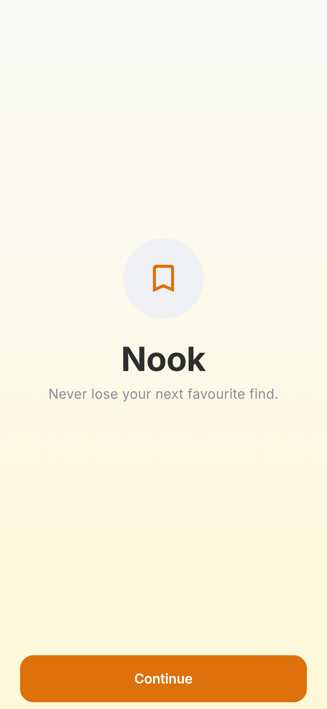
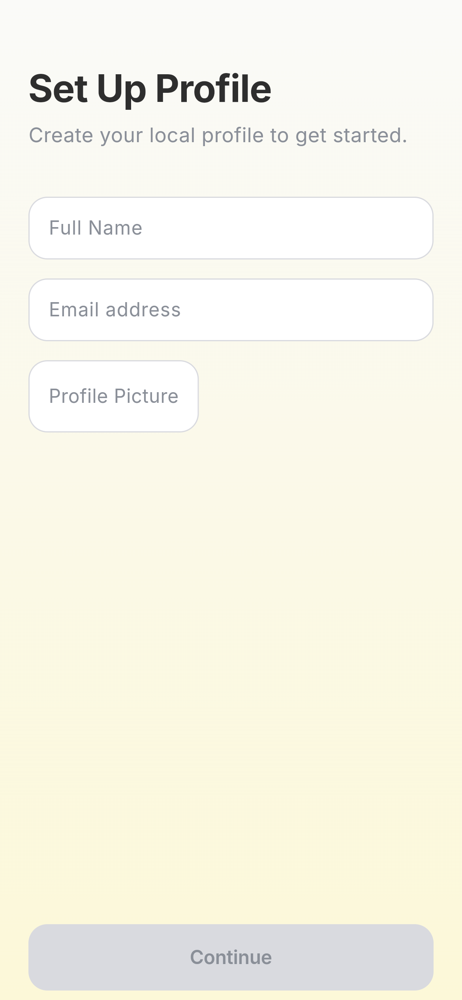
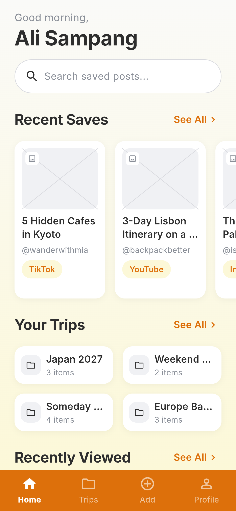
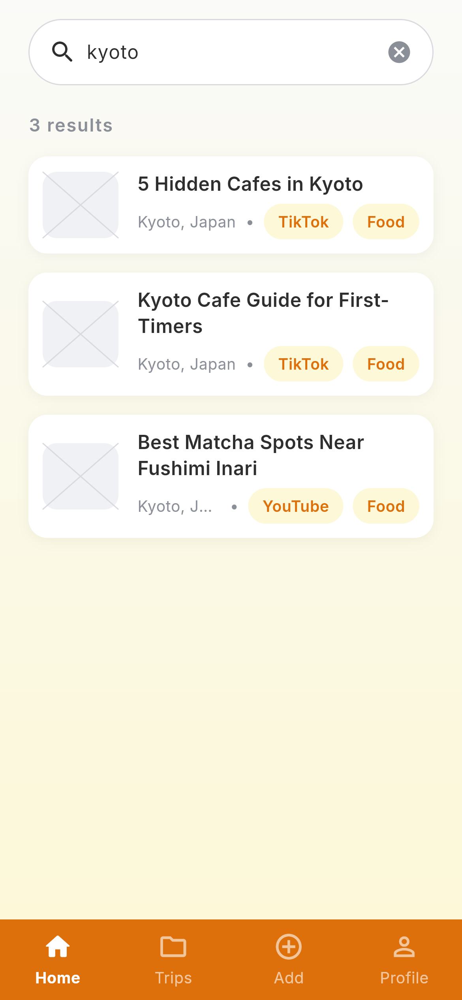
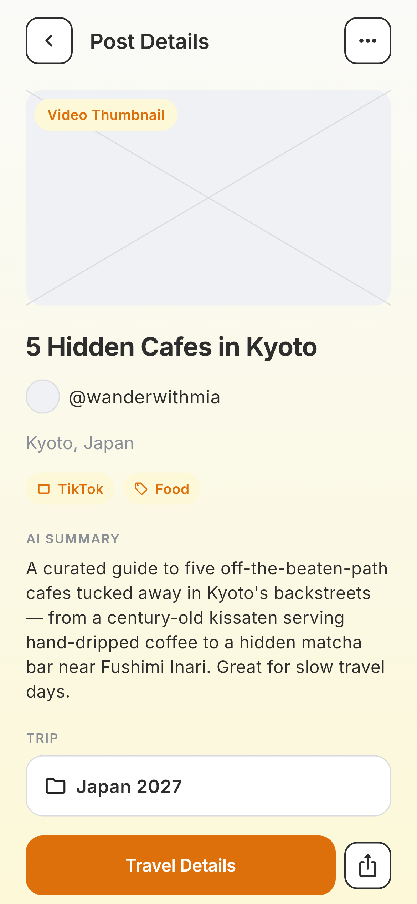
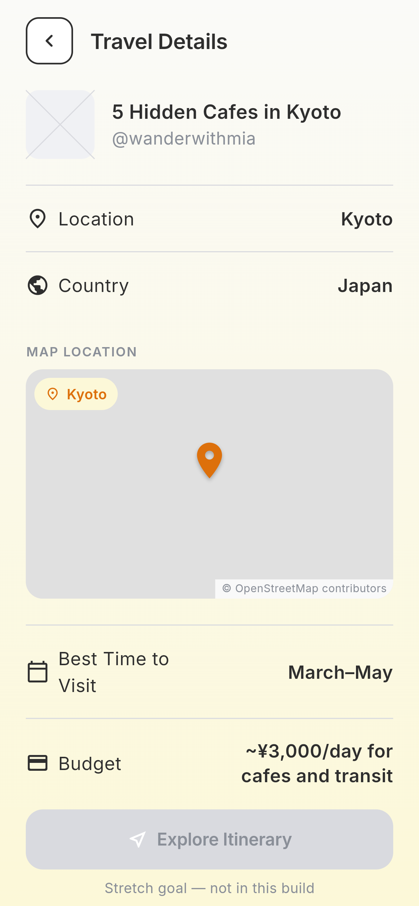

# Nook

> Never lose your next favourite find. Nook keeps the travel content you save on
> TikTok, Instagram, Facebook and YouTube in one place — grouped by trip, and
> searchable across every platform.

**Live demo:** https://alyencs.github.io/nook-flutter/
**Demo video:** `docs/demo.mp4` (link it here once it exists)
**Course:** Applications Development and Emerging Technologies (6ADET), Holy Angel University
**Author:** Alison C. Sampang

This repository lives in the author's own GitHub account and is public on
purpose. There is no `student.json` here and there should not be one: see
[docs/06-security-and-privacy.md](docs/06-security-and-privacy.md) for what a
public repo means for secrets and personal data.

---

## Screenshots

| Onboarding | Set up profile | Home | Search results |
| --- | --- | --- | --- |
|  |  |  |  |

| Post details | Travel details |
| --- | --- |
|  |  |

## What it does

Travellers find destinations, itineraries and tips scattered across four apps.
Saving them inside each one scatters trip research four ways, and none of those
Saved folders group content by trip or search across platforms. Nook does both.

- **Paste a link to save it.** TikTok, Instagram, Facebook or YouTube. The
  platform is recognised from the URL.
- **Detection fills in the details.** One AI call returns the destination,
  a travel category, a short summary, the country, the best time to visit and a
  rough budget. Anything it cannot tell you is left blank rather than invented,
  and the destination is editable before you save.
- **See where it is.** A save whose destination is specific enough to place gets
  a pin on a map in Travel Details. A region like "Southeast Asia" has no single
  point, so it keeps the placeholder and says why.
- **Group saves into trips.** "Japan 2027", "Weekend Getaways". A post belongs
  to exactly one trip and can be moved between them.
- **Search across everything.** One field matches titles, creators,
  destinations, countries, categories and your own notes.
- **Keep a personal note** on any save, written while the reason is still fresh
  and editable afterwards.

## Built with

| | |
| --- | --- |
| Framework | Flutter 3.47 (Dart 3.13) |
| State | `setState` plus Drift stream queries read through `StreamBuilder` — no state-management package |
| Storage | [Drift](https://drift.simonbinder.eu) — on-device SQL, five tables, works on web |
| AI | `google_generative_ai` (Gemini), behind an interface with a keyless fallback |
| Maps | `flutter_map` with OpenStreetMap tiles — no key, no billing account |
| Other packages | `flutter_dotenv` (keys out of git), `image_picker` (profile photo), `device_preview` (phone frame on the live link) |
| Type | Inter, bundled as a local asset |

Storage is on the device and nowhere else. That is a deliberate decision, not a
shortcut: two travellers never need to see the same saved posts, so a server
would be work for nothing, and a saved post belonging to exactly one trip is a
foreign key rather than a flat key-value box. The reasoning is in
[docs/01-proposal.md](docs/01-proposal.md); the trade-off accepted is that saves
do not sync between devices.

## Running it yourself

```bash
flutter pub get
cp .env.example .env      # required — see below
flutter run -d web-server --web-port 8080
```

`.env` is listed as an asset in `pubspec.yaml` (that is how `flutter_dotenv`
reads it), so **the file has to exist before the app will build**, even empty.
Copying `.env.example` is enough; the key itself is optional.

Then open http://localhost:8080. Built and tested with Flutter 3.47.2.

First launch seeds a small demo library — the trips and posts from the mockup —
so the app opens looking like the design instead of an empty database. All of it
is fictional. Settings has "Reset Demo Data" and "Clear All Data".

### Environment variables

This project reads its configuration from a `.env` file that is **not** in the
repository. Copy `.env.example`, fill in your own values, and never commit the
result.

| Variable | What it is | Where to get one |
| --- | --- | --- |
| `GEMINI_API_KEY` | Powers destination, category, summary and coordinate detection. Optional — without it Nook runs its sample extractor and says so on screen. | https://aistudio.google.com/apikey |
| `GEMINI_MODEL` | Optional model override. Defaults to `gemini-2.5-flash`. | — |

### Turning on real extraction

1. Get a key at https://aistudio.google.com/apikey.
2. Put it in `.env` at the root of the project: `GEMINI_API_KEY=your-key-here`
3. Restart the app — `.env` is read once at startup, so a hot reload will not
   pick it up.

**Profile → Settings** shows which extractor is running, so you can confirm the
key was found without saving anything. Paste Link says so too, before you spend
a link finding out.

**The Gemini key is never deployed.** It is not a repository secret and not a
`--dart-define`. Anyone can read a value compiled into a web build and spend the
quota behind it, so the published site runs without one. See below.

## The published build, and what it does differently

The live link is built by GitHub Actions and served from GitHub Pages. It ships
with no Gemini key, so extraction there is handled by a deterministic sample
extractor: the same link always produces the same result, and the app labels it
*"Sample data — this build ships without an AI key"* on the screen where it
matters. Real Gemini extraction runs locally and is shown in the demo video.

One interface, two implementations, chosen at startup by whether a key is
present — the same fallback pattern the proposal planned for the map feature.

## Privacy and secrets

- **What is stored, and where.** A local profile (name, email, optional photo),
  saved posts, trips and recent searches — all in a Drift database on the
  device. Nothing is uploaded, shared or synced. There is no account and no
  server. Clearing data in Settings is the whole deletion process.
- **Where the secrets live.** `GEMINI_API_KEY` lives in `.env`, which is
  git-ignored. It is deliberately *not* a repository secret, so the deploy
  workflow cannot see it and the published build cannot leak it. The workflow
  creates a keyless `.env` from `.env.example` at build time.
- **What protects the data on the service side.** Nothing leaves the device, so
  there is no service side to protect.
- **Sample data.** Every trip, post, handle and link in the seeded library is
  invented. No real personal information appears in this repository, in the
  screenshots or in the video.

## Project documentation

| Document | |
| --- | --- |
| [Proposal](docs/01-proposal.md) | the problem, the users, the scope, the storage decision |
| [Mockup and wireframes](docs/02-mockup.md) | the screens and the flow between them |
| [Design system](docs/03-design-system.md) | palette, type scale, spacing, components |
| [Weekly reports](docs/04-weekly-reports.md) | what happened each week |
| [Demo video](docs/05-demo-video.md) | the recording and what it shows |
| [Security and privacy](docs/06-security-and-privacy.md) | the checklist, filled in |
| [Build plan](docs/07-build-plan.md) | how the three planning documents became this app, and the twelve conflicts resolved along the way |

## Status and what is next

**Working:** every screen in the mockup, plus a Trips tab and Trip Details that
the mockup never drew. Save by link or as a note, detection with an editable
result, trips, search, personal notes, moving and deleting posts, the local
profile, and the demo library with reset and clear.

**Deliberately not built:**

- **Itinerary generator** — stretch goal #3. The button is drawn and disabled,
  with a line saying why.
- **Connected Platforms** — stretch goal #1, and auto-sync needs each platform's
  API. The screen exists as drawn, disabled, and says so.
- **Sharing** — the share button on Post Details is drawn but inert.
- **Instagram and Facebook thumbnails** — both retired their public oEmbed
  endpoints, so reading a preview image from either now needs a Meta app, an
  access token and app review. Those saves keep the drawn placeholder. YouTube
  thumbnails are derived from the video id and work with no key at all; TikTok
  is attempted through its public oEmbed endpoint and falls back quietly when
  the browser is not allowed to read it.
- **Thumbnails for the seeded demo library** — its links are invented, so no
  real preview image exists for them. Save a real link to see thumbnails.

**Known limits.** Extraction reads the link itself — its host, its slug, its
handle — because those pages cannot be fetched from a browser. A URL that names
its subject extracts well; an opaque one may come back without a destination,
which is why every field is optional and editable. Testing this across real
links from each platform is the next thing on the list.

## Credits

- Packages: see `pubspec.yaml`
- Typeface: [Inter](https://rsms.me/inter/) by Rasmus Andersson, SIL Open Font License 1.1
- Icons: Material Icons, Apache License 2.0

## AI use

Claude (Anthropic) was used as a pair programmer for this project: turning the
proposal, mockup and design system into an implementation plan, then writing
code against that plan under review. The planning documents, the design and the
decisions recorded in `docs/07-build-plan.md` are the author's own; where the
three documents contradicted each other, the resolutions were chosen by the
author and are listed there.

## Licence

MIT, see [LICENSE](LICENSE).
