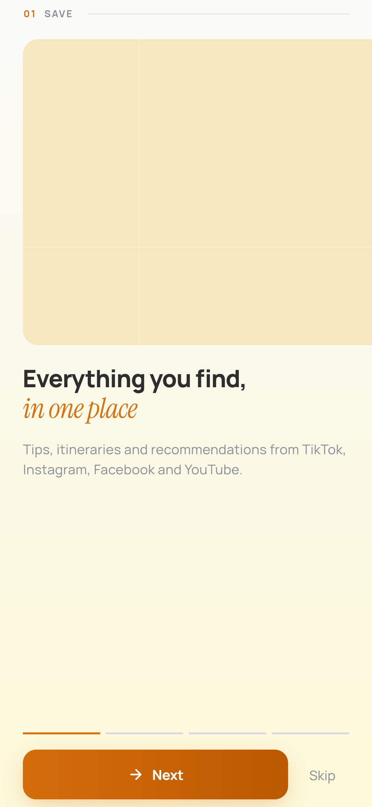
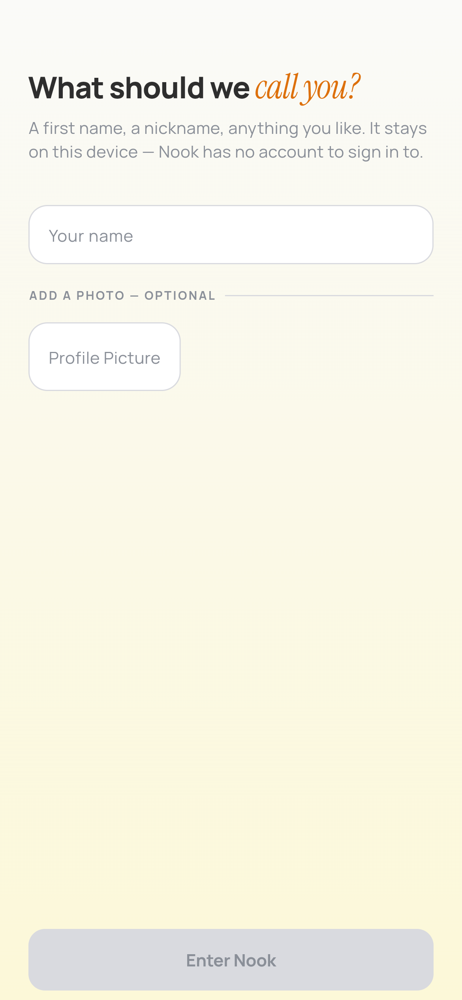
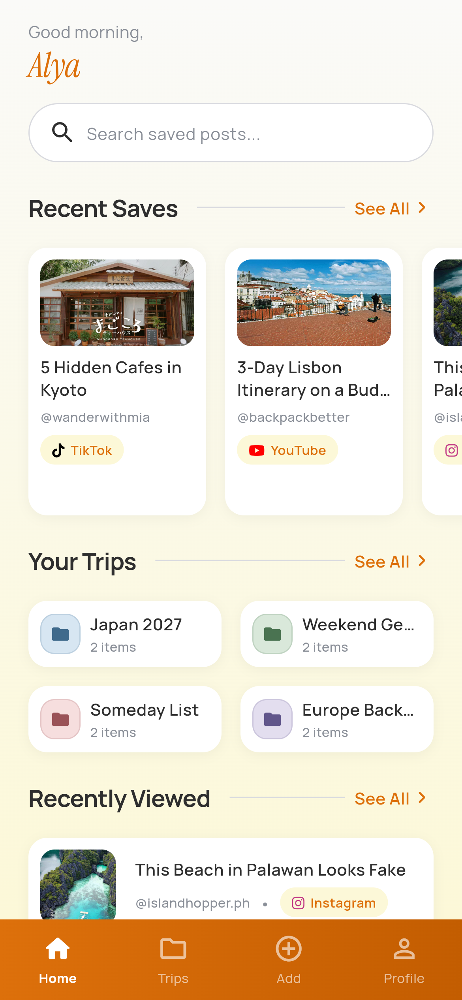
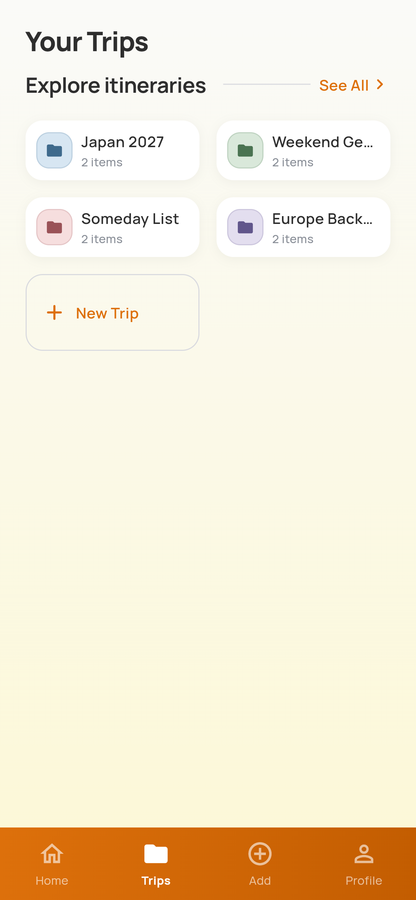
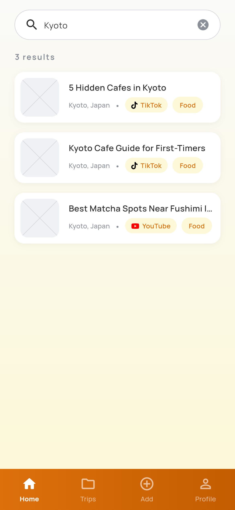
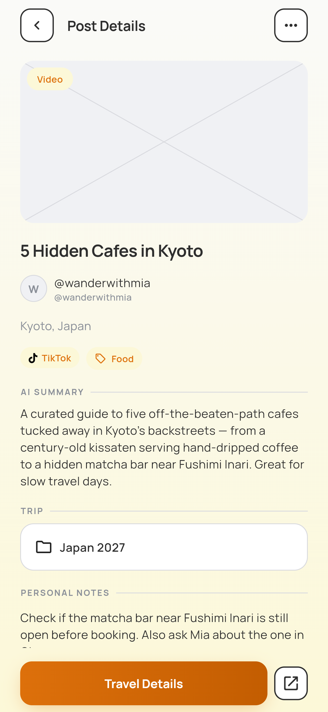
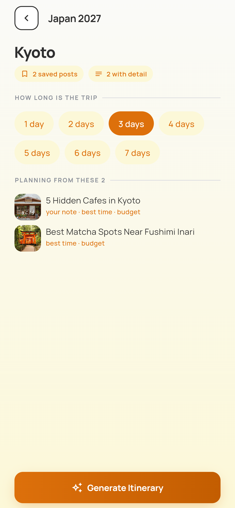
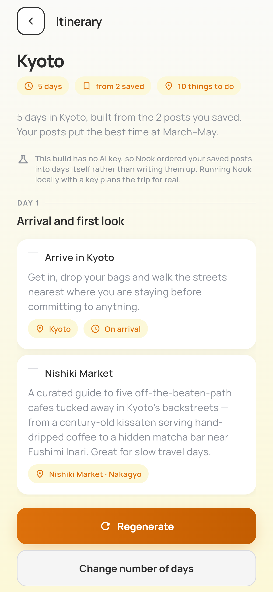
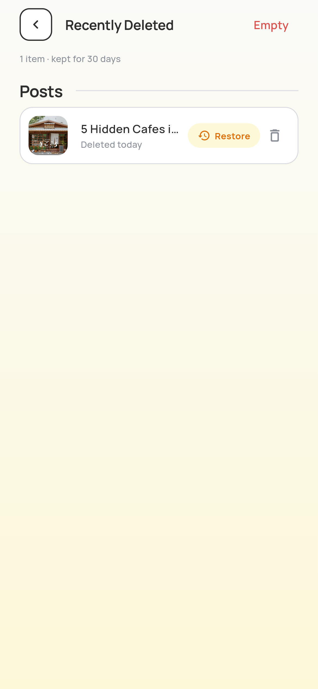

# Nook

> Never lose your next favourite find. Nook saves the travel content you find on
> TikTok, Instagram, Facebook and YouTube in one place — grouped by trip,
> searchable across every platform, and able to turn what you saved into a
> day-by-day itinerary — for travellers whose trip research is currently
> scattered across four apps.

**Live demo:** https://alyencs.github.io/nook-flutter/
**Demo video:** https://github.com/alyencs/nook-flutter/tree/main/docs/demo
**Course:** Applications Development and Emerging Technologies (6ADET), Holy Angel University
**Author:** Alison C. Sampang

This repository lives in the author's own GitHub account and is public on
purpose. There is no `student.json` here and there should not be one: see
[`docs/06-security-and-privacy.md`](docs/06-security-and-privacy.md) for what a
public repo means for secrets and personal data, and
[`SECURITY-CHECKLIST.md`](SECURITY-CHECKLIST.md) for the audit behind it.

---

## Screenshots

| Onboarding | Set up profile | Home |
| --- | --- | --- |
|  |  |  |

| Trips | Search results | Post details |
| --- | --- | --- |
|  |  |  |

| Choose a duration | Generated itinerary | Recently Deleted |
| --- | --- | --- |
|  |  |  |

*Captured from the current build at 390×844 on a 3× screen — a window that
size is already phone-shaped, so the frame stands aside and the app fills it.
The itinerary shown is the keyless one: the machine they were taken on has no API
key, so Nook's own planner arranged the saved posts and the screen says so.
Travel Details is not included because its map tiles could not be reached from
that machine. The live link renders both.*

## What it does

- **Paste a link to save it** — TikTok, Instagram, Facebook or YouTube. The
  platform is recognised from the URL. Nook is also a Web Share Target, so once
  it is installed to a home screen you can share straight into it and analysis
  has already started by the time the app opens.
- **Detection reads the post, not just the link.** Nook fetches what the platform
  publishes — a YouTube title and description, a TikTok caption — and hands that
  to the model, which returns the place, a category, a summary, the country, the
  best time to visit, a rough budget, the venues the post named and its tips.
  Anything it cannot tell you is left blank rather than invented.
- **Write a note instead.** Not everything worth keeping is a link, so a post can
  be typed rather than pasted and lives alongside the saved ones.
- **Group saves into trips** with coloured folders, and see where a save is on a
  map you can drag, pinch and zoom.
- **Explore Itinerary turns a trip into a plan.** Pick a trip, choose how many
  days, and Nook builds a day-by-day itinerary out of the posts already saved
  into it — the venues they named, the tips in them and your own notes. See
  [below](#explore-itinerary).
- **Search across everything** — titles, creators, destinations, countries,
  categories and your own notes, in one field.
- **Delete without losing anything.** Deleted posts and trips wait in Recently
  Deleted for 30 days and can be restored.
- **Onboarding that explains the app, not a sign-up.** A splash, four
  illustrated pages and one question — what to call you. There is no account,
  no password and no email, because there is no server.
- **Export everything** as one JSON file: the profile, the trips, every saved
  post with its full extraction and notes, the search history and the settings.

## How it works

Nook is a single Flutter web app with no backend. Everything a person saves
lives in a [Drift](https://drift.simonbinder.eu) (SQLite) database on their own
device, and the only thing that ever leaves it is a link they asked Nook to
analyse.

```
a link ──▶ platform lookup (oEmbed / Graph API)
                 │
                 ▼
          Claude Haiku 4.5 ──▶ structured JSON ──▶ editable review ──▶ Drift
                                                                        │
    saved posts in a trip ──▶ Claude Haiku 4.5 ──▶ a day-by-day itinerary
```

- `lib/ai/` — the model client, the two AI features, and a keyless fallback for
  each. It knows nothing about Drift or Flutter widgets.
- `lib/data/` — the Drift database, its tables, the DAOs and the demo seed.
- `lib/screens/` — one folder per area: onboarding, home, search, add, details,
  trips, explore, profile.
- `lib/widgets/`, `lib/theme/` — the design system: one place each for colour,
  type, spacing, motion and the shared components.
- `AppScope`, an `InheritedWidget`, hands the database, the DAOs and the chosen
  AI services down the tree. There is no state-management package: screens read
  Drift's stream queries through `StreamBuilder`, so saving a post updates Home,
  Trips and Search on its own.

## AI functionality

**Provider:** Anthropic. **Model:** Claude Haiku 4.5
(`claude-haiku-4-5-20251001`), pinned by id so a new release cannot change how
an installed build behaves. `CLAUDE_MODEL` overrides it.

Nook calls the Messages API directly over HTTP (`lib/ai/claude_api.dart`), with
retry and backoff that honour the server's own `retry-after`. Both features ask
for structured output through a forced tool call, so the reply arrives as a
decoded object of a known shape rather than prose that has to be parsed.

Two features use it:

1. **Extraction** (`lib/ai/claude_extractor.dart`) — reads one saved link into a
   destination, a category, a summary, coordinates, the venues it named and its
   tips. Every field is optional, and a field the source does not support comes
   back null rather than guessed.
2. **Explore Itinerary** (`lib/ai/claude_itinerary_generator.dart`) — builds a
   plan from several saved posts at once.

**Without a key, both still work.** `SampleExtractor` and
`SampleItineraryGenerator` do the same jobs deterministically and without a
network, and the UI says on screen which one produced what you are looking at.
That is what the published GitHub Pages build runs, because a billable key must
never be compiled into a public web build.

### Explore Itinerary

From the Trips tab, **Explore itineraries → a trip → a number of days →
Generate**.

- **The saved posts are the context.** Each post's title, caption, summary,
  place names, area, city, country, best time, budget note, tips and your own
  personal note are sent as the material to plan from. Nothing is invented from
  the destination's reputation and nothing is summarised on the way in.
- **You choose the length** — 1 to 7 days. The generator is held to the number
  you picked: more days than asked for are trimmed, and fewer is reported rather
  than padded out with a day nobody planned.
- **A trip with nothing in it is refused before a call is made**, as is a trip
  whose posts are only titles, with a message saying what to add.
- **The result** is a day-by-day plan — a title per day, two to five activities,
  each with a description and, where the posts support it, a place and a time —
  plus a one-line overview. Regenerate and change-the-duration are on the same
  screen.
- Two taps on Generate make one request, not two.

## Built with

| | |
| --- | --- |
| Framework | Flutter (Dart), web target |
| State | `setState` plus Drift stream queries read through `StreamBuilder` — no state-management package, because every screen reads one query and a package would be ceremony |
| Storage | [Drift](https://drift.simonbinder.eu) — on-device SQL, five tables at schema version 7, works on web. Chosen over Hive because a post belonging to exactly one trip is a foreign key, not a key-value pair |
| AI | Anthropic Messages API, Claude Haiku 4.5, called over `http` with structured output via tool use |
| Other packages | `http` (the Messages API and the oEmbed lookups — plain HTTP, so the status code survives and a retryable 529 can be told from a fatal 400), `flutter_map` + `latlong2` (OpenStreetMap tiles, no key and no billing account), `flutter_dotenv` (keys out of git), `image_picker` (profile photo), `url_launcher`, `font_awesome_flutter` (platform brand marks) |

Storage is on the device and nowhere else, deliberately: two travellers never
need to see the same saved posts, so a server would be work for nothing. The
trade-off accepted is that saves do not sync between devices. The five tables are
`users`, `trips`, `saved_posts`, `recent_searches` and `app_settings`; the
reasoning is in [`docs/01-proposal.md`](docs/01-proposal.md).

## Running it yourself

```bash
flutter pub get
cp .env.example .env      # required, even left empty — see below
flutter run -d web-server --web-port 8080
```

Then open http://localhost:8080. Built and tested with **Flutter 3.47.6 /
Dart 3.13.5**; `pubspec.yaml` requires Dart `^3.8.0`. This is a web-only project
— there is no `android/` or `ios/` directory.

`.env` is listed as an asset in `pubspec.yaml` (that is how `flutter_dotenv`
reads it), so **the file has to exist before the app will build**, even empty.
Every value in it is optional; Nook runs with none of them set, and first launch
seeds a small fictional demo library so the app opens looking like the design.

```bash
flutter analyze    # clean
flutter test       # 336 tests, 331 passing — see known issues below
flutter build web --release
dart run build_runner build --delete-conflicting-outputs   # after editing lib/data/tables.dart
```

Which commit is live is readable at
`https://<username>.github.io/<repo>/build.txt`: a run that fails to deploy
leaves the previous build up, and from the browser the two look the same.

There is no flag for the phone frame. `DemoFrame`
(`lib/widgets/demo_frame.dart`) draws one when the window is wider than a
phone and stands aside when it is not, so a narrow window — or a phone — gets
the app full width without being asked.

### Environment variables

This project reads its configuration from a `.env` file that is **not** in the
repository. Copy `.env.example`, fill in your own values, and never commit the
result.

| Variable | What it is | Where to get one |
| --- | --- | --- |
| `ANTHROPIC_API_KEY` | Powers destination, category, summary and coordinate detection, and writes the Explore Itinerary plans. **Billable.** Without it Nook runs a deterministic sample extractor and sample planner, and says so on screen. | https://console.anthropic.com/settings/keys |
| `YOUTUBE_API_KEY` | YouTube Data API v3. Fetches a video's description — where the addresses and prices are — and the creator's profile picture. Free tier, no billing account. Without it, extraction works from the title alone. | [Enable YouTube Data API v3](https://console.cloud.google.com/apis/library/youtube.googleapis.com) |
| `FACEBOOK_TOKEN` | `APP_ID\|CLIENT_TOKEN` from a Meta app with **oEmbed Read**. The only way to read an Instagram or Facebook caption — both withdrew public oEmbed in 2020. Without it those two extract from the URL alone, and the prompt says so. | [developers.facebook.com/apps](https://developers.facebook.com/apps) → Settings → Advanced |
| `CLAUDE_MODEL` | Optional model id to pin. Not a secret. Without it Nook uses the fast tier it pins itself. | — |

**No key is ever deployed.** None of these is a repository secret or a
`--dart-define`. Anyone can read a value compiled into a web build and spend the
quota behind it, so the GitHub Pages build is created from a keyless
`.env.example` and runs the sample extractor. Real extraction runs locally and is
shown in the demo video.

### Backend and API requirements

There is **no backend to run** — no server, no database to provision, no
account system, no migrations to apply anywhere but the device. The app talks to
four external services, all of them optional:

| Service | Used for | Needs a key |
| --- | --- | --- |
| `api.anthropic.com` | Extraction and itinerary generation | `ANTHROPIC_API_KEY` |
| YouTube and TikTok oEmbed | A post's real title, creator and thumbnail | No |
| YouTube Data API, Meta Graph API | A video's description; Instagram and Facebook captions | `YOUTUBE_API_KEY`, `FACEBOOK_TOKEN` |
| `tile.openstreetmap.org` | Map tiles on Travel Details | No |

Because the Anthropic call is made from the client, a web build carries whatever
key is in its `.env`. That is why the deployed build carries none. If you ever
want real AI on a public deployment, the key has to move behind a server you
control — see [`docs/06-security-and-privacy.md`](docs/06-security-and-privacy.md).

## Privacy and secrets

- **What is stored.** A local profile (a name and an optional photo), saved posts,
  trips, recent searches and four settings toggles — all in a Drift database on
  the device. Nothing is uploaded, shared or synced. There is no account and no
  server, so there is no service side to protect: no Firestore rules, no Supabase
  RLS, no credentials. The only thing that ever leaves the device is a link you
  asked Nook to analyse, plus what the platform has already published about it.
- **Where the secrets live.** `.env`, which is git-ignored — and was ignored from
  the very first commit, before any such file existed. The deploy workflow builds
  from a keyless `.env.example`, so the published site has nothing to leak.
- **No real personal information** appears in the sample data, the screenshots or
  the video. Every trip, post, handle and link in the seeded library is invented.

The full audit, including the open items, is
[`SECURITY-CHECKLIST.md`](SECURITY-CHECKLIST.md).

## Project documentation

| Document | |
| --- | --- |
| [Proposal](docs/01-proposal.md) | the problem, the users, the scope |
| [Mockup and wireframes](docs/02-mockup.md) | what it looks like, and the screen flow |
| [Design system](docs/03-design-system.md) | colours, type, spacing, components |
| [Weekly reports](docs/04-weekly-reports.md) | what happened each week |
| [Demo video](docs/05-demo-video.md) | the recording and what it shows |
| [Security and privacy](docs/06-security-and-privacy.md) | the checklist, filled in |
| [Security checklist](SECURITY-CHECKLIST.md) | the audit, item by item |
| [AI use](AI-USAGE.md) | the full account of how AI was used |

## Status and what is next

**Working:** every screen in the mockup, plus the Trips tab and Trip Details the
mockup never drew. Save by link, by share or as a note; detection with an
editable result; trips with folder colours; Explore Itinerary with a chosen
duration; search; personal notes; an interactive map; Recently Deleted with
restore and a 30-day window; a local profile with an adjustable photo crop; and a
complete JSON export.

**Deliberately not built:** Connected Platforms — auto-sync from a connected
account — is drawn as designed with every control disabled and labelled. Sharing
a post *out* of Nook is drawn but inert.

**Known issues, honestly:**

- **Five tests fail on the seeded library.** `dao_test.dart` and
  `widget_test.dart` assert counts and coordinates that the current demo seed no
  longer matches. They are assertions about the fixture, not about the app, and
  they are the next thing to fix.
- **The 40-link extraction test is still outstanding.** Ten real links per
  platform, logging how often a usable destination comes back. It is the
  mitigation the proposal committed to for its biggest risk, and it needs a
  normal network and a key.
- **Creator profile pictures are YouTube-only.** Of the four platforms, only
  YouTube exposes an avatar through a route Nook can legitimately use, and only
  with a `YOUTUBE_API_KEY`. Everywhere else the UI draws the creator's initial
  rather than inventing a face.
- **Instagram and Facebook need a token for anything beyond the URL.** Without
  `FACEBOOK_TOKEN` those saves keep the drawn placeholder and extract from the
  link alone.
- **Extraction quality still depends on what the platform publishes.** An opaque
  URL may come back without a destination, which is why every field is optional
  and editable.

## Credits

- Packages: see `pubspec.yaml`
- Nook logo: the author's own. The splash mark in `assets/images/` is cut from
  the supplied `nook_logo.png` along its own gutters — the four crops reassemble
  into that file exactly.
- Typefaces: [Manrope](https://github.com/sharanda/manrope) by Mikhail Sharanda,
  and [Instrument Serif](https://github.com/Instrument/instrument-serif) standing
  in for PP Editorial New, which is licensed from Pangram Pangram and cannot be
  committed — both SIL Open Font License 1.1
- Icons: Material Icons, Apache License 2.0
- Platform logos: [Font Awesome Free](https://fontawesome.com) brand icons, CC BY 4.0
- Map tiles: © OpenStreetMap contributors, ODbL
- Seeded destination photographs: Wikimedia Commons, under their own licences
- Onboarding photographs: `assets/images/onboarding_1.jpg` … `onboarding_4.jpg`,
  under their own licences

## AI use


**Claude (Anthropic), used heavily, and directed throughout.** It wrote the first
full build and much of what followed, working to my specification and under my
review — I specified it, rejected parts of it, and merged all of it.

**About a quarter of this application is mine: 23% of `lib/` and 29% of `test/`
by line, across 27 of the repository's 47 commits.** That includes Explore
Itinerary end to end — eight files and 1,906 lines with no AI co-authorship on any
of the commits — the Anthropic Messages API client in `lib/ai/claude_api.dart`,
which I wrote by hand over plain `http` so a retryable overload stays
distinguishable from a fatal bad request, and 1,977 lines of tests covering that
client, both itinerary generators and the three Explore screens. Nook's motion
system is mine as well, along with the planning documents the whole app is shaped
by.

I reviewed what Claude produced and rejected a fair amount of it, including a
splash screen that assembled a logo it had invented twice.

The full account — eight examples of how I used it, three cases where it was
wrong, and the line-by-line authorship breakdown with the commands to reproduce
it — is in [AI-USAGE.md](AI-USAGE.md).

## Licence

MIT, see [LICENSE](LICENSE).
